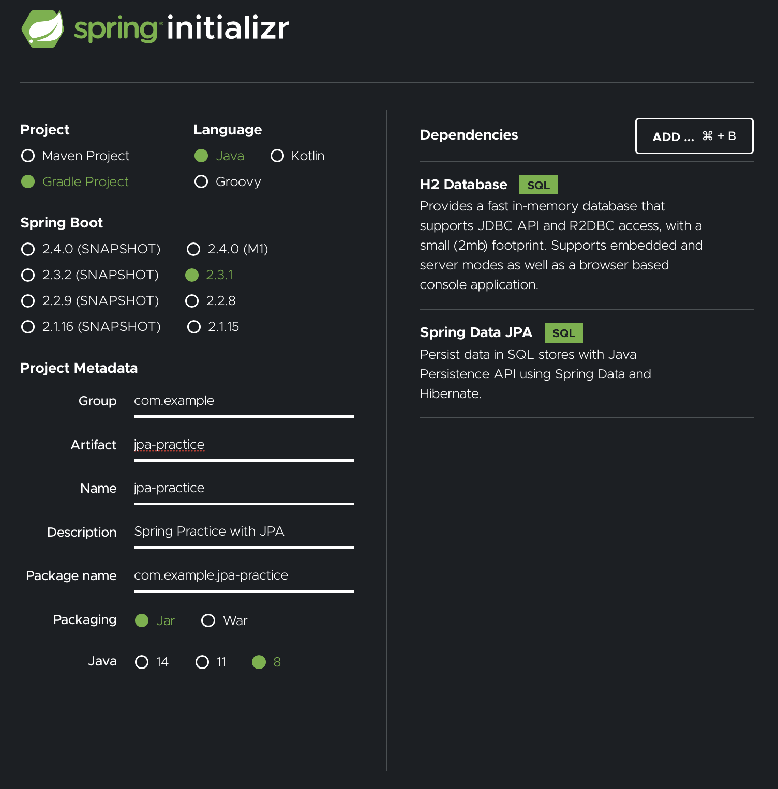

### Accessing Data with JPA

#### Objective

---

- Spring Data JPA를 사용해서 관계형 데이터베이스에 데이터를 저장하고 조회해보자
- Customer라는 POJOs (Plain Old Java Objects)를 In-Memory 데이터베이스에 저장할 것이다

#### Prerequisite

---

- 15분
- IDE (STS or IntelliJ)
- JDK 1.8 or later (나의 환경은 Open JDK 1.8.0)
- Gradle 4+

##### Step 1. Set up Project

---

- Spring Initializer 사용, Spring Data JPA와 H2 Database를 의존성에 추가한다

- 설정 캡처
  

##### Step 2. Define a Simple Entity

---

- Customer Objects를 저장할 것이고, 각 오브젝트들은 JPA Entity로 매핑된다고 생각하자
- 아래는 Customer 클래스를 정의한 것이다

  ```java
  package com.example.jpapractice;
  import sun.jvm.hotspot.memory.Generation;
  import javax.persistence.Entity;
  import javax.persistence.GeneratedValue;
  import javax.persistence.Id;
  @Entity
  public class Customer {

      @Id
      @GeneratedValue(strategy = Generation.AUTO)
      private long id;
      private String firstName;
      private String lastName;

      protected Customer() {}

      public Customer(String firstName, String lastName){
          this.firstName = firstName;
          this.lastName = lastName;
      }

      @Override
      public String toString(){
          return String.format("Customer[id=%d, firstName = '%s', lastName = '%s']", id, firstName, lastName);
      }

      public long getId() {
          return id;
      }

      public String getFirstName() {
          return firstName;
      }

      public String getLastName() {
          return lastName;
      }
  }
  ```

  - id, firstName, lastName이라는 3개의 속성을 갖는 Customer 클래스를 정의하였다.
  - 2개의 생성자가 있는데, 기본 생성자는 JPA를 위해 존재하는 것이다. 직접적으로 사용하지는 않고, protected 메소드임을 확인할 수 있다.
  - 다른 생성자는 실제로 인스턴스를 생성하기 위해 사용되는 생성자로. 데이터베이스에 그 정보가 저장된다
  - @Entity: 이 클래스가 JPA Entity임을 나타낸다. @Table이라는 어노테이션은 없기 때문에, Customer라는 이름을 갖는 테이블과 Entity는 서로 매핑된다고 생각할 수 있다
  - @Id: id라는 속성이 객체의 ID라는 것을 JPA에게 알린다.
  - @GeneratedValue: id값이 자동적으로 생성되어야 한다는 것을 알린다.
  - 별도의 어노테이션이 없는 firstName과 lastName과 같은 변수의 경우 컬럼에 매핑된다고 볼 수 있다

##### Step 3. Create Simple Queries

---

- Spring DATA JPA는 JP를 사용하여 관계형 데이터베이스에 데이터를 저장한다
- 런타임에 Repository Interface로부터 데이터 저장소를 자동적으로 구현할 수 있다
- Customer Entity와 함께 동작할 수 있는 Repository를 만들자

  - src/main/java/com/example/jpapractice/CustomerRepository.java

  ```java
  package com.example.jpapractice;

  import java.util.List;
  import org.springframework.data.repository.CrudRepository;

  public interface CustomerRepository extends CrudRepository<Customer, Long> {

    List<Customer> findByLastName(String lastName);

    Customer findById(long id);
  }
  ```

  - **CustomerRepository** 는 CrudRepository 인터페이스를 상속한다
  - <Customer, Long>: Customer Entity, Long은 ID의 타입을 의미 (Generic Parameter)
  - CrudRepository를 상속함으로써, Customer Persistence와 상호작용할 수 있는 여러 메소드를 사용할 수 있게 된다
    - Saving, Deleting, Finding
  - Spring Data JPA를 사용하면 Method Signature를 선언하여 쿼리 메소드를 정의할 수 있다
    - findByLastName() 메소드가 그 예시
  - 일반적인 자바 어플리케이션은 CustomerRepository를 구현하는 별도의 클래스를 작성해야 하겠지만, Spring DATA JPA를 사용하면 그럴 필요 없이 런타임에 자동적으로 생성해준다

##### Step 4. Create an Application Class

---

- Spring DATA JPA를 사용하는 메인 로직을 추가해보자

  - src/main/java/com/example/jpapractice/AccessingDataJpaApplication.java

  ```java
  package com.example.accessingdatajpa;
  import org.slf4j.Logger;
  import org.slf4j.LoggerFactory;
  import org.springframework.boot.CommandLineRunner;
  import org.springframework.boot.SpringApplication;
  import org.springframework.boot.autoconfigure.SpringBootApplication;
  import org.springframework.context.annotation.Bean;

  @SpringBootApplication
  public class AccessingDataJpaApplication {

    private static final Logger log = LoggerFactory.getLogger(AccessingDataJpaApplication.class);

    public static void main(String[] args) {
      SpringApplication.run(AccessingDataJpaApplication.class);
    }

    @Bean
    public CommandLineRunner demo(CustomerRepository repository) {
      return (args) -> {
        // save a few customers
        repository.save(new Customer("Jack", "Bauer"));
        repository.save(new Customer("Chloe", "O'Brian"));
        repository.save(new Customer("Kim", "Bauer"));
        repository.save(new Customer("David", "Palmer"));
        repository.save(new Customer("Michelle", "Dessler"));

        // fetch all customers
        log.info("Customers found with findAll():");
        log.info("-------------------------------");
        for (Customer customer : repository.findAll()) {
          log.info(customer.toString());
        }
        log.info("");

        // fetch an individual customer by ID
        Customer customer = repository.findById(1L);
        log.info("Customer found with findById(1L):");
        log.info("--------------------------------");
        log.info(customer.toString());
        log.info("");

        // fetch customers by last name
        log.info("Customer found with findByLastName('Bauer'):");
        log.info("--------------------------------------------");
        repository.findByLastName("Bauer").forEach(bauer -> {
          log.info(bauer.toString());
        });
        // for (Customer bauer : repository.findByLastName("Bauer")) {
        //  log.info(bauer.toString());
        // }
        log.info("");
      };
    }
  }
  ```

  - demo() 메소드에 CustomerRepository를 넣게 되는데, 이렇게 되면 먼저 Spring Application Context로부터 CustomerRepository를 가져온다.
  - 이 후 테스트 작업 수행
  - demo()는 CommandLineRunner bean을 반환하는데, 이는 어플리케이션 시작 시 자동적으로 실행되는 코드이다

> 기본적으로, Spring Boot는 JPA Repository Support를 활성화하여 @SpringBootApplication이 있는 패키지와 서브패키지 안을 확인한다. 그 후 Repository Interface 등을 체크하는 것.
