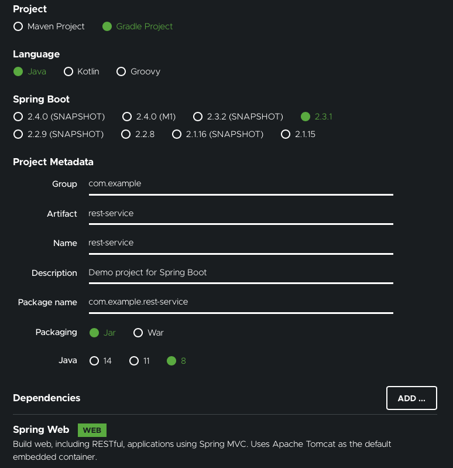

### Building a Restful Web Service

#### Objective

---

- HTTP GET Request를 http://localhost:8080/greeting 엔드포인트에서 받는 웹 서비스를 만들어보자
- Response?

  - JSON 형식의 Greeting 데이터로 응답하게 될 것
    ```json
    { "id": 1, "content": "Hello, World!" }
    ```
  - 쿼리 스트링 내에 Optional name parameter 값을 설정할 수 있도록 하여 Greeting 데이터를 커스터마이징할 것
    ```
    http://localhost:8080/greeting?name=User
    ```
  - 설정한 name parameter의 값은 기본값인 World를 덮어써서 아래와 같은 json 형태로 응답하게 될 것
    ```json
    { "id": 1, "content": "Hello, User!" }
    ```

#### Prerequisite

---

- 15분
- IDE
- JDK 1.8 or later (나의 환경은 Open JDK 1.8.0)
- Gradle 4+ or Maven 3.2+

##### Step 1. Starting with Spring Initializer

---

- 완성된 Github Repo를 클론해와도 되지만, From Scratch 해보자!
- 모든 스프링 어플리케이션은 [Spring Initializer](https://start.spring.io)로 시작하는 것이 좋다. 이 사이트는 어플리케이션에 필요한 모든 의존성을 당겨(Pull)오는 데에 빠른 방법을 제공하고, 셋업 과정도 대신해준다. 이 예제는 오로지 Spring Web 의존성만 요구한다.
- 설정 캡처

  

- Gradle로 빌드 시스템을 구성하여 프로젝트를 생성하였으므로, 프로젝트 내에는 build.gradle이 생겼을 것이다

##### Step 2. Create a Resource Representation Class

---

- 서비스를 만들 것이므로, 일단 웹 서비스의 상호작용에 대해 생각해보자

  1. 서비스는 /greeting 엔드포인트로 오는 GET 요청을 처리해야 하고
  2. 해당 요청을 처리할 때에 선택적으로 name parameter를 쿼리 스트링 내에서 얻을 것이다
  3. GET 요청은 200 OK 응답을 반환해야 하며, 응답의 Body에는 Greeting을 의미하는 JSON 데이터가 존재해야 한다

  ```json
  {
    "id": 1,
    "content": "Hello, World!"
  }
  ```

- 이 Greeting 표현(Representation)을 모델링하기 위해, Resource Representation Class를 만들자

  - src/main/java/com/example/restservice/Greeting.java

    ```java
    package com.example.restservice;
    public class Greeting {
      private final long id;
      private final String content;
      public Greeting(long id, String content) {
        this.id = id;
        this.content = content;
      }
      public long getId() {
        return id;
      }
      public String getContent() {
        return content;
      }
    }
    ```

    - 이 어플리케이션은 Greeting type의 데이터를 자동적으로 JSON화하기 위해 Jackson JSON 라이브러리를 사용한다
    - Jackson JSON Library는 기본적으로 Web Starter에 포함되어 있다.

##### Step 3. Create a Resource Controller

---

- Restful Web Service를 구현하기 위해 스프링이 접근하는 방식은 아래와 같다

  - HTTP Request는 Controller에 의해 처리된다
  - 이 컨트롤러는 @RestController라는 어노테이션에 의해 식별된다
  - 위의 설명대로 짜면 아래와 같이 src/main/java/com/example/restservice/GreetingController.java 을 작성할 수 있다

    ```java
    package com.example.restservice;
    import java.util.concurrent.atomic.AtomicLong;
    import org.springframework.web.bind.annotation.GetMapping;
    import org.springframework.web.bind.annotation.RequestParam;
    import org.springframework.web.bind.annotation.RestController;
    @RestController
    public class GreetingController {
      private static final String template = "Hello, %s!";
      private final AtomicLong counter = new AtomicLong();
      @GetMapping("/greeting")
      public Greeting greeting(@RequestParam(value = "name", defaultValue = "World") String name) {
        return new Greeting(counter.incrementAndGet(), String.format(template, name));
      }
    }
    ```

    - 이 컨트롤러는 짧고 간단하지만, 그 아래에서는 많은 일이 일어나고 있다
      - **@GetMapping** Annotation은 HTTP GET Requests -> /greeting을 greeting() 메소드로 연결한다
        - POST를 위해서는 @PostMapping을 사용한다
        - @RequestMapping도 유사한 기능을 제공하는데, @RequestMapping(method=GET)과 같이 작성한다
      - **@RequestParam** Annotation은 쿼리 스트링의 name parameter를 greeting 메소드의 name parameter로 연결해주며, 없을 경우 기본값도 설정한다
      - 메소드의 몸체 부분은 Greeting Object를 id/content와 함께 생성하여 반환한다
    - 전통적인 MVC Controller와 위의 Restful Web Service의 핵심적인 차이?
      - HTTP 응답 바디가 생성되는 방식에 차이가 있다. Greeting Object의 내용을 서버사이드에서 채워서 HTTP Response에 직접 써서 (물론 JSON 형태로) 전달한다
      - **@RestController** Annotation을 사용함으로써, 해당 클래스를 모든 메소드가 뷰의 관점에서 도메인 오브젝트를 반환하는 '컨트롤러'라고 표시한다
        - @RestController는 @Controller + @ResponseBody의 짧은 버전이다
    - Greeting Object(객체)는 반드시 JSON으로 변환되어야 한다.
      - 고맙게도 스프링의 HTTP Message Converter Support는 이를 직접 수행할 필요가 없게 해준다.
      - Classpath 내에 Jackson 2가 존재하기 때문에, Spring의 **MappingJackson2HttpMessageConverter**가 자동적으로 Greeting 인스턴스를 JSON으로 변환하기 위해 사용된다.
    - @SpringBootApplication Annotation은 아래의 것들을 모두 추가해주는 편리한 어노테이션이다
      - @Configuration: 클래스를 어플리케이션 텍스트의 빈 정의의 소스라고 표시한다
      - @EnableAutoConfigration: 스프링 부트로 하여금 클래스패스 설정을 기반으로 Beans, 다른 추가적인 Beans 및 Property 설정을 생성/추가하도록 한다. 예를 들면, spring-webmvc가 만약 classpath에 있다면, 이 어노테이션은 웹 어플리케이션으로 동작하도록 만들며 DispatcherServlet과 같은 핵심 Behavior를 활성화한다
      - @ComponentScan: 스프링으로 하여금 com/example 패키지 내에 있는 다른 컴포넌트, 설정, 서비스들을 확인하게 한다(왜 확인? 컨트롤러들을 찾기 위해서!)

  - main() 메소드는 쓰프링 부트의 SpringApplcation.run()을 호출하여 어플리케이션을 실행한다. XML은 단 한줄도 없다! (web.xml 따위의 것들)
  - 이 어플리케이션은 순수하게 100% 자바로 이루어졌으며 다른 Infra에 대한 설정을 할 필요가 없다

##### Step 4. Build an executable JAR

---

- Gradle / Maven의 CLI를 이용해 어플리케이션을 실행할 수 있다
- 또한, 모든 의존성, 클래스, 리소스들을 담은 단일 JAR을 빌드할 수도 있다
- Gradle을 사용한다면, 어플리케이션을 아래와 같이 실행할 수 있다.
  ```bash
  ./gradlew bootRun # 빌드와 실행까지 한 번에 수행함
  ```
  - 빌드를 따로 하고, 생성된 jar 파일을 별도로 실행하려면 아래와 같이 하면 된다
    ```bash
    ./gradlew build
    java -jar build/libs/rest-service-0.0.1-SNAPSHOT.jar
    ```
- Maven을 사용하면 아래와 같이 빌드 및 실행할 수 있다
  ```bash
  ./mvnw spring-boot:run # 빌드와 실행까지 한 번에 수행함
  ./mvnw clean package # 빌드
  java -jar target/rest-service-0.0.1-SNAPSHOT.jar # 실행
  ```

##### Step 5. Test the Service

---

- http://localhost:8080/greeting 에 접속하여 ?name=Euiyub도 넣어보고, id의 값이 변하는 것도 확인하자
- id값이 증가하는 걸로 보아, 동일한 GreetingController에서 Request를 처리하고 있음을 확인할 수 있다
