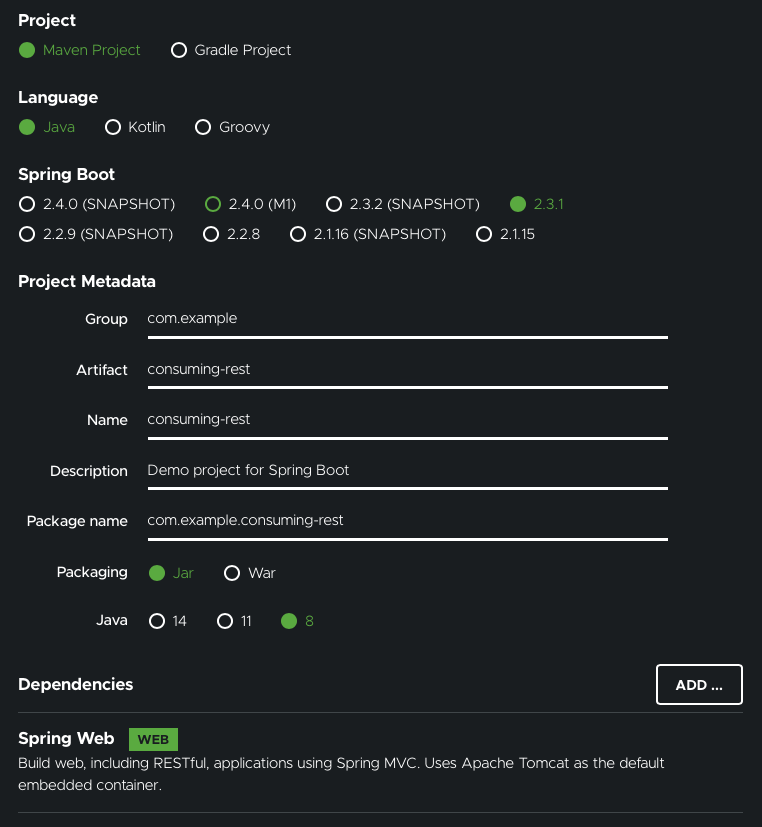

### Consuming a Restful Web Service

#### Objective

---

- Spring의 RestTemplate을 사용해서 임의의 Spring Boot Quotation을 가져와보자
- [Spring Boot Quotation](https://gturnquist-quoters.cfapps.io/api/random)
  - 임의의 인용문을 가져올 수 있는 API 서버!

#### Prerequisite

---

- 15분
- IDE
- JDK 1.8 or later (나의 환경은 Open JDK 1.8.0)
- Gradle 4+ or Maven 3.2+

##### Step 1. Starting with Spring Initializer

---

- Spring Initializer 사용!
- 설정 캡처

  

- Gradle로 빌드 시스템을 구성하여 프로젝트를 생성하였으므로, 프로젝트 내에는 build.gradle이 생겼을 것이다

##### Step 2. Fetching a REST Resource

---

- 프로젝트 셋업을 끝내고 나면, 다른 Restful Service를 Consuming하는 기능을 추가해보자
- https://gturnquist-quoters.cfapps.io/api/random 에서는 Spring Boot와 관련한 랜덤한 인용문을 JSON의 형태로 반환한다
- 브라우저를 통해 접속하거나 Curl로 요청을 보내면 아래의 데이터가 반환된다
  ```json
  {
    "type": "success",
    "value": {
      "id": 10,
      "quote": "Really loving Spring Boot, makes stand alone Spring apps easy."
    }
  }
  ```
- 그냥 데이터를 받아오는 것으로는 그렇게 유용하다고 볼 수 없다. 이 데이터를 좀 더 가지고 놀기 위해 Spring에서 제공하는 Template Class인 RestTemplate을 사용하자!
- RestTemplate은 **One-Line incantation**을 통해 Restful 서비스와 상호작용할 수 있고, 커스텀 도메인 타입과 데이터를 바인딩할 수도 있다
- 먼저, 필요한 데이터를 담을 도메인 클래스를 생성해보자.

  - src/main/java/com/example/consumingrest/Quote.java

    ```java
    package com.example.consumingrest;

    import com.fasterxml.jackson.annotation.JsonIgnoreProperties;

    @JsonIgnoreProperties(ignoreUnknown = true)
    public class Quote {

      private String type;
      private Value value;

      public Quote() {
      }

      public String getType() {
        return type;
      }

      public void setType(String type) {
        this.type = type;
      }

      public Value getValue() {
        return value;
      }

      public void setValue(Value value) {
        this.value = value;
      }

      @Override
      public String toString() {
        return "Quote{" +
            "type='" + type + '\'' +
            ", value=" + value +
            '}';
      }
    }
    ```

    - @JsonIgnoreProperties: Jackson Library로 하여금 이 데이터 타입과 바인딩되지 않은 어떤 Propertiy도 모두 무시하겠다는 의미
    - Custom Data Type에 데이터를 직접 바인딩하기 위해서는?
      - 변수의 이름이 무조건 API에서 반환되는 JSON의 key값과 동일해야 한다
      - 만약 동일하지 않으면, @JsonProperty 어노테이션을 이용해 정확한 키의 값을 지정해 줄 수 있다.
      - 이 예제에서는 모든 변수의 이름을 JSON key와 동일하게 맞추어 해당 어노테이션이 필요없도록 하였다
    - 추가적으로 JSON 데이터의 value key에 해당하는 또 다른 커스텀 데이터 타입을 정의하자

      - src/main/java/com/example/consumingrest/Value.java

      ```java
      package com.example.consumingrest;
      import com.fasterxml.jackson.annotation.JsonIgnoreProperties;
      @JsonIgnoreProperties(ignoreUnknown = true)
      public class Value {
        private Long id;
        private String quote;
        public Value() {
        }
        public Long getId() {
          return this.id;
        }
        public String getQuote() {
          return this.quote;
        }
        public void setId(Long id) {
          this.id = id;
        }
        public void setQuote(String quote) {
          this.quote = quote;
        }
        @Override
        public String toString() {
          return "Value{" +
              "id=" + id +
              ", quote='" + quote + '\'' +
              '}';
        }
      }
      ```

##### Step 3. Finishing the Application

---

- Initializer를 통해 프로젝트를 생성했다면 main() 메소드를 살펴보자.
- 기본적으로 Spring Web Application을 로드하는 코드만 있을 것이다
- Quotation을 확인하기 위해! 아래와 같은 기능들이 추가적으로 필요하다
  - A logger: 로그를 출력 (이 예제에서는 콘솔)
  - CommandLineRunner: 어플리케이션 초기화 시 RestTemplate을 실행
- 아래와 같이 수정해보자

  ```java
  package com.example.consumingrest;

  import org.slf4j.Logger;
  import org.slf4j.LoggerFactory;
  import org.springframework.boot.CommandLineRunner;
  import org.springframework.boot.SpringApplication;
  import org.springframework.boot.autoconfigure.SpringBootApplication;
  import org.springframework.boot.web.client.RestTemplateBuilder;
  import org.springframework.context.annotation.Bean;
  import org.springframework.web.client.RestTemplate;

  @SpringBootApplication
  public class ConsumingRestApplication {

    private static final Logger log = LoggerFactory.getLogger(ConsumingRestApplication.class);

    public static void main(String[] args) {
      SpringApplication.run(ConsumingRestApplication.class, args);
    }

    @Bean
    public RestTemplate restTemplate(RestTemplateBuilder builder) {
      return builder.build();
    }

    @Bean
    public CommandLineRunner run(RestTemplate restTemplate) throws Exception {
      return args -> {
        Quote quote = restTemplate.getForObject(
            "https://gturnquist-quoters.cfapps.io/api/random", Quote.class);
        log.info(quote.toString());
      };
    }
  }
  ```

##### Step 4. Running the Application

---

- Gradle을 사용한 프로젝트
  ```bash
  ./gradlew bootRun
  ```
