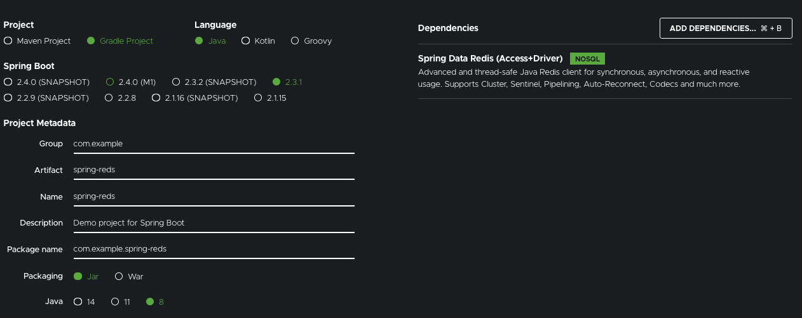

### Messaging With Redis

#### Objective

---

- StringRedisTemplate을 활용해서 문자열 데이터를 발행하고 MessageListenerAdapter를 이용해서 POJO 구독을 수행해보자

#### Prerequisite

---

- 15분
- IDE
- JDK 1.8 or later (나의 환경은 Open JDK 1.8.0)
- Gradle 4+ or Maven 3.2+

##### Step 1. Standing Up a Redis server

---

- redis를 설치하고 실행해보자
  ```bash
  brew install redis # 설치
  redis-server # 실행
  ```
  - 설치 중에 Permission Denied 에러가 난다면, 해당 디렉터리에 적절한 권한이 없는 경우이다
  - 아래의 명령어를 이용해 문제가 발생한 디렉터리에 권한을 주자
    ```bash
    sudo chown -R $(whoami) /usr/local/Cellar # /usr/local/Cellar: 해당 디렉터리의 경로
    ```
  - 그래도 오류 발생.. 공식 홈페이지에서 바이너리를 다운받아 컴파일하자
    ```bash
    wget http://download.redis.io/redis-stable.tar.gz
    tar xvzf redis-stable.tar.gz
    cd redis-stable
    make
    sudo cp src/redis-server /usr/local/bin
    sudo cp src/redis-cli /usr/local/bin
    ```
  - redis-server 실행
    ```bash
    redis-server
    ```

##### Step 2. Starting with Spring Initializer

---

- Spring Initializer 사용!
- 설정 캡처

  

##### Step 3. Create a Redis Message Receiver

---

- 어떤 메시징 베이스 어플리케이션에도 항상 메시지 발행자(Publisher)와 메시지 수신자(Receiver)가 있다
- Message Receiver를 만들기 위해, 아래와 같이 코드를 작성하자

  - src/main/java/com/example/springredis

  ```java
  package com.example.springredis;
  import java.util.concurrent.atomic.AtomicInteger;

  import org.slf4j.Logger;
  import org.slf4j.LoggerFactory;

  public class Receiver {
      private static final Logger LOGGER = LoggerFactory.getLogger(Receiver.class);

      private AtomicInteger counter = new AtomicInteger();

      public void receiveMessage(String message) {
          LOGGER.info("Received <" + message + ">");
          counter.incrementAndGet();
      }

      public int getCount() {
         return counter.get();
      }
  }
  ```

  - Receiver는 POJO로써, 메시지를 받는 메소드를 정의한다. Receiver를 메시지 리스너로 등록하게 되면, 메시지 핸들링 메소드의 이름은 편한대로 정할 수 있다

##### Step 4. Register the Listener and Send a Message

---

- Spring Data Redis는 Redis를 통한 메시지 송수신에 필요한 모든 컴포넌트를 제공한다
- 몇 개 적어보면 아래와 같은 것들이 있다
  - A connection factory: 템플릿과 메시지 리스너 컨테이너를 구동시키며, 레디스 서버에 접속할 수 있도록 한다
  - A message listener container
  - A Redis template
- Redis Template을 사용해서 메시지를 보내고, Receiver를 Message Listener와 함께 등록함으로써 구현할 수 있다

- 이 예제에서는 기본적인 RedisConnectionFactory를 사용하며, 이 인스턴스는 JedisConnectionFactory라는 Jedis Redis 라이브러리를 기반으로 한다
- 커넥션 팩토리는 Message Listener Container와 Redis Template에 아래와 같이 Injected된다

  - src/main/java/com/example/springredis/SpringRedisApplication.java

    ```java
    package com.example.springredis;

    import org.slf4j.Logger;
    import org.slf4j.LoggerFactory;
    import org.springframework.boot.SpringApplication;
    import org.springframework.boot.autoconfigure.SpringBootApplication;
    import org.springframework.context.ApplicationContext;
    import org.springframework.context.annotation.Bean;
    import org.springframework.data.redis.connection.RedisConnectionFactory;
    import org.springframework.data.redis.core.StringRedisTemplate;
    import org.springframework.data.redis.listener.PatternTopic;
    import org.springframework.data.redis.listener.RedisMessageListenerContainer;
    import org.springframework.data.redis.listener.adapter.MessageListenerAdapter;

    @SpringBootApplication
    public class SpringRedisApplication {
        private static final Logger LOGGER = LoggerFactory.getLogger(SpringRedisApplication.class);
        @Bean
        RedisMessageListenerContainer container(RedisConnectionFactory connectionFactory,
                                                MessageListenerAdapter listenerAdapter) {

            RedisMessageListenerContainer container = new RedisMessageListenerContainer();
            container.setConnectionFactory(connectionFactory);
            container.addMessageListener(listenerAdapter, new PatternTopic("chat"));

            return container;
        }

        // Message Listener 메소드는 container 메소드 내에 정의된 Message Listener Container로 등록하기 위해서 Bean Annotation 사용
        // 코드에 따라 chat 토픽을 구독하게 된다
        @Bean
        MessageListenerAdapter listenerAdapter(Receiver receiver) {
            return new MessageListenerAdapter(receiver, "receiveMessage");
        }
        // Receiver 클래스가 POJO이기 때문에, Message Listener Adapter 내에 래핑(Wrapping)될 필요가 있다
        // Message Listener Adapter는 MessageListener 인터페이스를 구현한다 (addMessageListener() 호출을 위해 필요)
        @Bean
        Receiver receiver() {
            return new Receiver();
        }
        // 메시지를 전송하기 위해 필요한 Redis Template.
        @Bean
        StringRedisTemplate template(RedisConnectionFactory connectionFactory) {
            return new StringRedisTemplate(connectionFactory);
        }
        public static void main(String[] args) throws InterruptedException {
            // 모든 것을 Kickoff하는 코드.
            // Application Context는 Message Listener Container를 시작하고, Listening을 시작한다
            // StringRedisTemplate을 가져와서 chat 토픽에 Hello from Message를 전송한다.
            ApplicationContext ctx = SpringApplication.run(SpringRedisApplication.class, args);
            StringRedisTemplate template = ctx.getBean(StringRedisTemplate.class);
            Receiver receiver = ctx.getBean(Receiver.class);

            while (receiver.getCount() == 0) {
                LOGGER.info("Sending message...");
                template.convertAndSend("chat", "Hello from Redis!");
                Thread.sleep(500L);
            }
            System.exit(0);
        }
    }
    ```

##### Step 5. Running the Application

---

- Gradle을 사용한 프로젝트
  ```bash
  ./gradlew bootRun
  ```
- 결과
  ```bash
  2020-07-12 19:41:52.622  INFO 14384 --- [           main] c.e.springredis.SpringRedisApplication   : Started SpringRedisApplication in 1.524 seconds (JVM running for 1.882)
  2020-07-12 19:41:52.624  INFO 14384 --- [           main] c.e.springredis.SpringRedisApplication   : Sending message...
  2020-07-12 19:41:52.637  INFO 14384 --- [    container-2] com.example.springredis.Receiver         : Received <Hello from Redis!>
  ```
