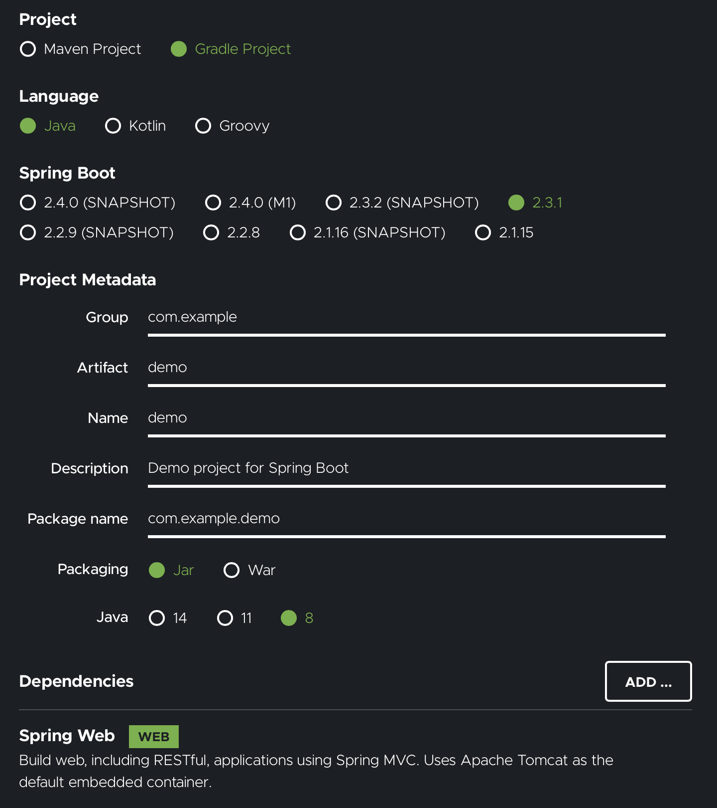

### Spring Quickstart Guide

#### Objective

---

- Spring으로 기본적인 "Hello World" 프로젝트를 작성해보자
- 브라우저가 해당 프로젝트 (엔드포인트)에 연결할 수 있으며, 보다 친근한 방식으로 웹 사이트가 반응하도록 만들 수 있다

#### Prerequisite

---

- IDE(Integrated Developer Environment) such as IntelliJ IDEA, Spring Tools, Visual Studio Code, Eclipse, etc.
- JDK (Java Development Kit)

##### Step 1: Start a new Spring Boot Project

---

- [start.spring.io](https://start.spring.io) 에서 Spring Boot(앱 내에서 스프링을 사용할 수 있도록 준비해주는 프레임워크)가 포함된 프로젝트를 생성할 수 있다.
- Spring Boot를 사용하면 Spring 설정에 요구되는 복잡한 코드와 설정 (Configuration)을 편하게 할 수 있다.
- 튜토리얼에서는 Maven으로 의존성 관리를 하나, 나는 Gradle로 하자!
- Spring Boot 버전의 경우 Snapshot이 아닌 최신 버전으로 하자!
  - Snapshot의 의미? [Spring Boot Version Convention](https://stackoverrun.com/ko/q/12656392)
    - GA: General Availability의 약자로, Public에 배포된 버전들을 의미함
    - CURRENT: 가장 최근의 GA Release
    - PRE: Upcoming GA Release에 대해 개발자들로 하여금 Feature Testing을 할 수 있도록 제공되는 버전. 발견된 버그들은 동일 버전의 Pre-Release에서 수정될 수 있다
      - 예를 들어, 2.0.0 M1에서 발견된 버그가 2.0.0 M2에서 수정됨. M은 Milestone을 의미
    - SNAPSHOT: PRE와 동일하나, 가장 최근의 변화들을 포함하여 매일 빌드됨 (변동사항이 잦다)
- 최종 설정 캡처

  

##### Step 2: Add your code

---

- 기본적인 웹 서버를 구축하는 데에 필요한 코드를 직접 채워넣어보자

  ```java
      package com.example.demo;
      import org.springframework.boot.SpringApplication;
      import org.springframework.boot.autoconfigure.SpringBootApplication;
      // Spring Annotation 사용을 위한 Import
      import org.springframework.web.bind.annotation.GetMapping;
      import org.springframework.web.bind.annotation.RequestParam;
      import org.springframework.web.bind.annotation.RestController;

      @SpringBootApplication
      @RestController
      public class DemoApplication {

          public static void main(String[] args) {
              SpringApplication.run(DemoApplication.class, args);
          }

          // 새로 추가한 메소드
          @GetMapping("/hello")
          public String hello(@RequestParam(value = "name", defaultValue = "World") String name) {
              return String.format("Hello %s!", name);
          }
      }
  ```

  - hello Method는 String Argument를 받으며 Spring Annotation에 의해 HTTP Request의 value=name 으로 넘어온 값을 사용
  - 만약 name을 Euiyub이라고 설정하여 Request에 넣어 전송하면, 응답은 "Hello Euiyub"이 될 것
  - @RestController Annotation?
    - 스프링으로 하여금 이 코드가 웹에서 이용 가능한 엔드포인트임을 알게 한다
  - @GetMapping("/hello")?
    - 스프링으로 하여금 hello() 메소드가 http://localhost:8080/hello 주소로 오는 요청에 대해 응답을 하기 위한 메소드라고 알려줌
  - @RequestParam?
    - 스프링으로 하여금 Request 안에 name이라는 value가 올 것을 기대하도록 하며, 만약 없으면 기본 값으로 World를 사용하도록 설정

##### Step 3: Try it

---

- Maven을 사용한다면 터미널에서 아래의 명령어를 이용하여 스프링 프로젝트를 로드할 수 있다
  ```bash
  ./mvnw spring-boot:run # MacOS / Linux
  mvnw spring-boot:run # Windows
  ```
